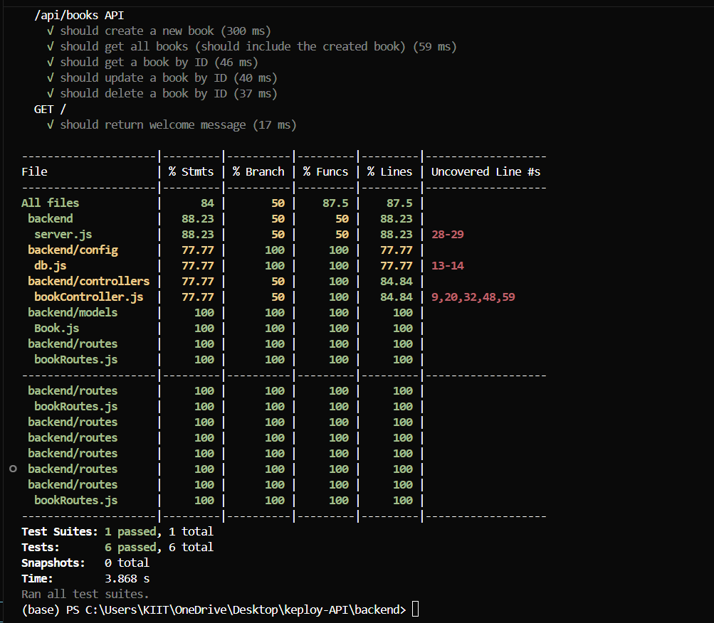
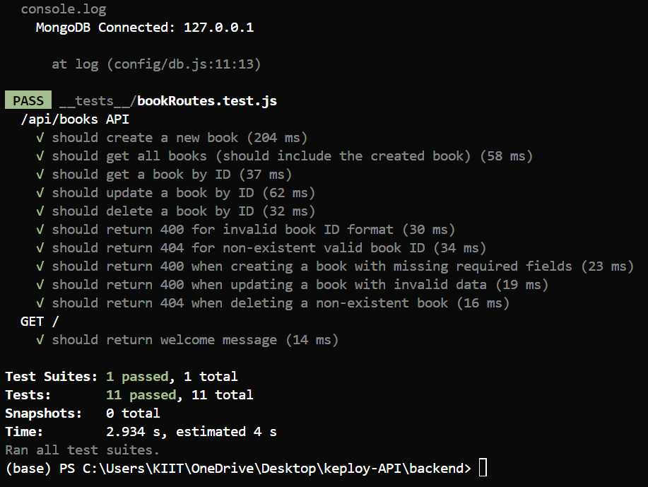
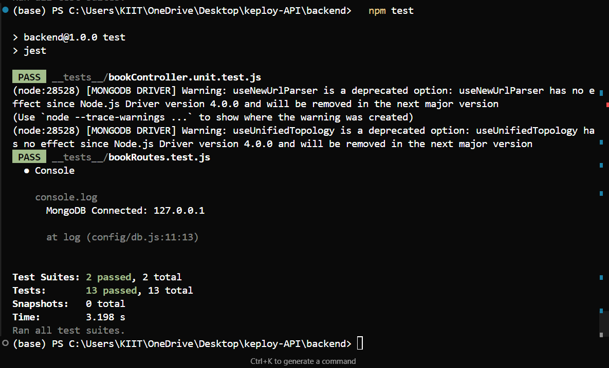
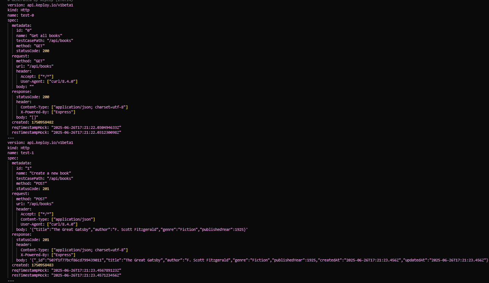

# Book Management App(Keploy Session-2 Task on APIs) 

A full-stack Book Management application with a Node.js + Express + MongoDB backend and a Vite + React frontend. This project includes a complete suite of unit, integration, and API tests with **Keploy integration for automated API testing**.

---

## Tech Stack

### Backend
- **Runtime:** Node.js
- **Framework:** Express.js
- **Database:** MongoDB with Mongoose ODM
- **Testing:** Jest, Supertest, **Keploy**
- **Containerization:** Docker

### Frontend
- **Library:** React
- **Build Tool:** Vite
- **Styling:** CSS

---

## Features
- Custom API with at least 4 endpoints: Create, Read (all & by ID), Update, Delete books
- MongoDB database integration for persistent storage
- User-friendly React frontend for interacting with the API
- Environment variables for configuration
- CORS enabled for frontend-backend communication
- **Automated API testing with Keploy**
- **Docker containerization for consistent testing environment**

---

## API Endpoints

All endpoints are prefixed with `/api/books`.

| Method | Endpoint             | Description                |
|--------|----------------------|----------------------------|
| GET    | /api/books           | Get all books              |
| GET    | /api/books/:id       | Get a book by ID           |
| POST   | /api/books           | Add a new book             |
| PUT    | /api/books/:id       | Update a book by ID        |
| DELETE | /api/books/:id       | Delete a book by ID        |

### Sample Requests & Responses

#### Get All Books
- **GET** `/api/books`
- **Response:**
```json
[
  {
    "_id": "...",
    "title": "Book Title",
    "author": "Author Name",
    "genre": "Genre",
    "publishedYear": 2023,
    "createdAt": "...",
    "updatedAt": "..."
  }
]
```

#### Add a Book
- **POST** `/api/books`
- **Body:**
```json
{
  "title": "Book Title",
  "author": "Author Name",
  "genre": "Genre",
  "publishedYear": 2023
}
```
- **Response:**
```json
{
  "_id": "...",
  "title": "Book Title",
  "author": "Author Name",
  "genre": "Genre",
  "publishedYear": 2023,
  "createdAt": "...",
  "updatedAt": "..."
}
```

#### Update a Book
- **PUT** `/api/books/:id`
- **Body:**
```json
{
  "title": "Updated Title",
  "author": "Updated Author",
  "genre": "Updated Genre",
  "publishedYear": 2024
}
```
- **Response:**
```json
{
  "_id": "...",
  "title": "Updated Title",
  "author": "Updated Author",
  "genre": "Updated Genre",
  "publishedYear": 2024,
  "createdAt": "...",
  "updatedAt": "..."
}
```

#### Delete a Book
- **DELETE** `/api/books/:id`
- **Response:**
```json
{
  "message": "Book deleted successfully"
}
```

---

## Database Integration
- **Database Used:** MongoDB
- **Integration:** Mongoose ODM is used to define the Book schema and interact with the MongoDB database. All CRUD operations are performed via Mongoose models.

---

## How to Run the Project

### Backend (API Server)
1.  Navigate to the `backend` directory:
    ```sh
    cd backend
    ```
2.  Install dependencies:
    ```sh
    npm install
    ```
3.  Create a `.env` file with your MongoDB connection string:
    ```env
    PORT=3545
    MONGO_URI=mongodb://127.0.0.1:27017/bookdb
    ```
4.  Ensure MongoDB is running.
5.  Start the server:
    ```sh
    npm run dev
    ```

### Frontend (Web App)
1.  Navigate to the `frontend` directory:
    ```sh
    cd frontend
    ```
2.  Install dependencies:
    ```sh
    npm install
    ```
3.  Start the frontend app:
    ```sh
    npm run dev
    ```
4.  Open the provided URL (e.g., `http://localhost:5173`) in your browser.

---

## Testing

This project uses **Jest** for unit and integration testing, **Supertest** for API endpoint testing, and **Keploy** for automated API testing.

### Traditional Testing (Jest + Supertest)

#### How to Run Tests
1.  Navigate to the `backend` directory.
2.  Run all tests:
    ```sh
    npm test
    ```
3.  To generate a coverage report:
    ```sh
    npm run test:coverage
    ```

#### Test Coverage
Here is the test coverage report for the API:


#### Integration Test Results
Screenshot of the successful integration and API tests:


#### Unit Test Results
Screenshot of the successful unit tests with mocked dependencies:


### Keploy API Testing

#### Overview
Keploy is an open-source API testing tool that automatically generates test cases by recording real API interactions. It provides:
- **Automated test case generation** from real API calls
- **Database mocking** for isolated testing
- **Test replay** functionality
- **CI/CD integration** capabilities

#### Keploy Setup

##### Prerequisites
- Docker installed and running
- Keploy CLI installed

##### Configuration Files
The project includes the following Keploy configuration:

1. **keploy.yml** - Main Keploy configuration
2. **tests.yaml** - Generated test cases covering all CRUD operations
3. **mocks.yaml** - Database mocks for isolated testing

##### Test Cases Generated
The `tests.yaml` file includes comprehensive test coverage:

| Test ID | Method | Endpoint | Description |
|---------|--------|----------|-------------|
| test-0 | GET | /api/books | Get all books (empty) |
| test-1 | POST | /api/books | Create new book |
| test-2 | GET | /api/books | Get all books after creation |
| test-3 | GET | /api/books/:id | Get book by ID |
| test-4 | PUT | /api/books/:id | Update book by ID |
| test-5 | DELETE | /api/books/:id | Delete book by ID |
| test-6 | GET | /api/books | Verify deletion (empty) |

#### Running Keploy Tests

##### 1. Start MongoDB Container
```bash
docker run -d --name mongodb --network keploy-network -p 27017:27017 mongo:latest
```

##### 2. Build and Run Backend Container
```bash
docker build -t book-api .
docker run -d --name book-api --network keploy-network -p 3545:3545 book-api
```

##### 3. Record Test Cases (Optional)
```bash
keploy record --cport 3545
```

##### 4. Run Keploy Tests
```bash
keploy test --cport 3545 --delay 10
```

#### Keploy Test Results
The Keploy integration successfully:
-  Generated 7 comprehensive test cases
-  Covered all CRUD operations (Create, Read, Update, Delete)
-  Included proper HTTP headers and status codes
-  Created realistic request/response data
-  Configured database mocks for isolated testing


*This screenshot demonstrates the Keploy API test execution and results.*

#### Benefits of Keploy Integration
1. **Automated Testing**: Reduces manual test case creation
2. **Real-world Testing**: Tests actual API behavior
3. **Database Mocking**: Isolated testing without external dependencies
4. **CI/CD Ready**: Easy integration into deployment pipelines
5. **Comprehensive Coverage**: Tests all endpoints with realistic data

#### File Structure
```
backend/
├── keploy/
│   ├── keploy.yml          # Keploy configuration
│   │   ├── tests.yaml      # Generated test cases
│   │   └── mocks.yaml      # Database mocks
│   └── reports/            # Test execution reports
├── Dockerfile              # Container configuration
└── keploy-test-summary.md  # Detailed testing documentation
```

---

## Docker Integration

### Containerization
The backend is fully containerized with Docker for consistent testing and deployment:

```dockerfile
FROM node:18-alpine
WORKDIR /app
COPY package*.json ./
RUN npm install
COPY . .
EXPOSE 3545
CMD ["npm", "start"]
```

### Docker Commands
```bash
# Build the image
docker build -t book-api .

# Run the container
docker run -p 3545:3545 book-api

# Run with custom network
docker run --network keploy-network -p 3545:3545 book-api
```

---

## Assignment Requirements

This project successfully meets all the Keploy Session-2 Task requirements:

 **Custom API with 4+ endpoints**: Complete CRUD operations for books
 **MongoDB Integration**: Full database integration with Mongoose
 **Unit Testing**: Comprehensive Jest test suite
 **Integration Testing**: API endpoint testing with Supertest
 **Keploy Integration**: Automated API testing with test case generation
 **Docker Support**: Containerized application for consistent testing
 **Documentation**: Complete setup and usage documentation

---

## 📂 Project Repository

[https://github.com/ayushh8/keploy-API](https://github.com/ayushh8/keploy-API)
